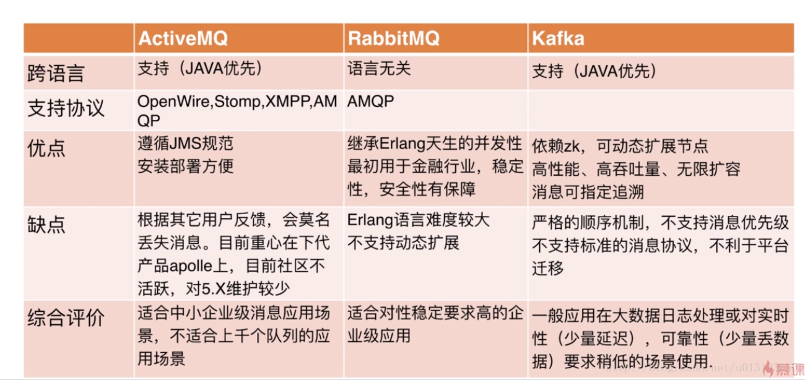
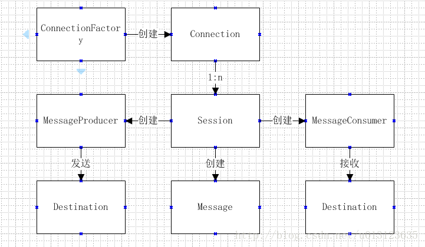

# Java消息中间件（基础）

## 1、概念

### 中间件：

​	非底层操作系统软件，非业务应用软件，不是直接给最终用户使用的，不能直接给客户带来价值的软件统称为中间件。 

### 消息中间件 ：

​	管制关注于数据的发送和接收，利用高效可靠的异步消息传递机制集成分布式系统。 

优点 ：

1.解耦 2 .异步 3.横向扩展 4. 安全可靠 5. 顺序保证（比如kafka） 

### jms :

​	java消息服务(Java Message Service)即JMS，是一个Java平台中关于面向消息中间件的api，用于在两个应用程序之间，或分布式系统中发送消息，进行异步通信 。

### AMQP :

​	AMQP(advanced message queuing protocol)是一个提供统一消息服务的应用层标准协议，基于此协议的客户端与消息中间件可传递消息，并不受客户端/中间件不同产品，不同开发语言等条件的限制 。

常见消息中间件 :
​	activeMQ（支持多语言，实现jms1.1，j2ee1.4规范），RabbitMQ（支持更多语言，基于AMQP规范），kafka(高吞吐量，分布式，分区,O(1)磁盘顺序提供消息持久化) 

 

### JMS消息模式 :

- 队列模式

  客户端包括生产者和消费者 
  队列中的消息只能被一个消费者消费 
  消费者可以随时消费队列中的消息 

- 主题模式 

  客户端包括发布者和订阅者 
  主题中的消息被所有订阅者消费 
  消费者不能消费订阅之前就发送到主题中的消息 


### JMS编码接口: 

ConnectionFactory 用于创建连接到消息中间件的连接工厂 
Connection 代表了应用程序和消息服务器之间的通信链路 
Destination 指消息发布和接收的地点，包括队列或主题 
Session 表示一个单线程的上下文，用于发送和接收消息 
MessageConsumer 由会话创建，用于接收发送到目标的消息 
MessageProducer 由会话创建，用于发送消息到目标 
Message 是在消费者和生产者之间传送的对象，消息头，一组消息属性，一个消息体 
 

## 2、安装ActiveMQ

官网 ： [`http://activemq.apache.org/`](`http://activemq.apache.org/` ) 

Windows:

解压后，进入bin目录，运行activemq.bat。

进入浏览器[http://127.0.0.1:8161]()

用户名和密码默认为admin

## 3、jms演示

创建maven项目 
添加依赖

```java
 <dependency>
      <groupId>org.apache.activemq</groupId>
      <artifactId>activemq-all</artifactId>
      <version>5.9.0</version>
    </dependency>
```

### 队列模式

创建队列模式的生产者AppProducer

```java
package com.jms.queue;

import javax.jms.Connection;
import javax.jms.ConnectionFactory;
import javax.jms.Destination;
import javax.jms.JMSException;
import javax.jms.MessageProducer;
import javax.jms.Session;
import javax.jms.TextMessage;

import org.apache.activemq.ActiveMQConnectionFactory;

public class AppProducer {
    public static final String url = "tcp://localhost:61616";
    public static final String queueName = "queue-test ";

    public static void main(String[] args) throws JMSException {
        //1.创建连接工厂
        ConnectionFactory connectionFactory = new ActiveMQConnectionFactory(url);

        //2.创建Connection
        Connection connection = connectionFactory.createConnection();

        //3.启动连接
        connection.start();

        //4.创建会话 第一个参数：是否在事务中去处理， 第二个参数.应答模式
        Session session = connection.createSession(false, Session.AUTO_ACKNOWLEDGE);

        //5.创建一个目标
        Destination destination = session.createQueue(queueName);

        //6创建一个生产者
        MessageProducer producer = session.createProducer(destination);
        for (int i = 0; i < 100; i++) {
            //7.创建消息
            TextMessage textMessage = session.createTextMessage("test:"+i);
            producer.send(textMessage);
            System.out.println("发送消息:"+textMessage.getText());
        }
        //9关闭连接
        connection.close();
    }
}
```

消费者 AppConsumer

```java
package com.jms.queue;

import javax.jms.Connection;
import javax.jms.ConnectionFactory;
import javax.jms.Destination;
import javax.jms.JMSException;
import javax.jms.Message;
import javax.jms.MessageConsumer;
import javax.jms.MessageListener;
import javax.jms.Session;
import javax.jms.TextMessage;

import org.apache.activemq.ActiveMQConnectionFactory;

public class AppConsumer {
    public static final String url = "tcp://localhost:61616";
    public static final String queueName = "queue-test ";

    public static void main(String[] args) throws JMSException {
        //1.创建连接工厂
        ConnectionFactory connectionFactory = new ActiveMQConnectionFactory(url);

        //2.创建Connection
        Connection connection = connectionFactory.createConnection();

        //3.启动连接
        connection.start();

        //4.创建会话 第一个参数：是否在事务中去处理， 第二个参数.应答模式
        Session session = connection.createSession(false, Session.AUTO_ACKNOWLEDGE);

        //5.创建一个目标
        Destination destination = session.createQueue(queueName);

        //6创建一个消费者
        MessageConsumer consumber = session.createConsumer(destination);

        //7创建一个监听器
        consumber.setMessageListener(new MessageListener() {

            public void onMessage(Message message) {
                TextMessage textMessage = (TextMessage) message;
                try {
                    System.out.println("接收消息："+textMessage.getText());
                } catch (JMSException e) {
                    e.printStackTrace();
                }

            }
        });

        //8关闭连接  消息是异步的 ，在程序退出是关闭，在这里不可以关闭
        //connection.close();
    }
}
```

可以在 [http://127.0.0.1:8161/admin/queues.jsp](http://127.0.0.1:8161/admin/queues.jsp) 查看运行效果(8161 默认端口)

### 主题模式

创建主题模式发布者AppProducer

```java
package com.jms.topic;

import javax.jms.Connection;
import javax.jms.ConnectionFactory;
import javax.jms.Destination;
import javax.jms.JMSException;
import javax.jms.MessageProducer;
import javax.jms.Session;
import javax.jms.TextMessage;

import org.apache.activemq.ActiveMQConnectionFactory;

public class AppProducer {
    public static final String url = "tcp://localhost:61616";
    public static final String topicName = "topic-test ";

    public static void main(String[] args) throws JMSException {
        //1.创建连接工厂
        ConnectionFactory connectionFactory = new ActiveMQConnectionFactory(url);

        //2.创建Connection
        Connection connection = connectionFactory.createConnection();

        //3.启动连接
        connection.start();

        //4.创建会话 第一个参数：是否在事务中去处理， 第二个参数.应答模式
        Session session = connection.createSession(false, Session.AUTO_ACKNOWLEDGE);

        //5.创建一个目标
        Destination destination = session.createTopic(topicName);

        //6创建一个生产者
        MessageProducer producer = session.createProducer(destination);
        for (int i = 0; i < 100; i++) {
            //7.创建消息
            TextMessage textMessage = session.createTextMessage("test:"+i);
            producer.send(textMessage);
            System.out.println("发送消息:"+textMessage.getText());
        }
        //9关闭连接
        connection.close();
    }
}
```

订阅者AppConsumer

```java
package com.jms.topic;

import javax.jms.Connection;
import javax.jms.ConnectionFactory;
import javax.jms.Destination;
import javax.jms.JMSException;
import javax.jms.Message;
import javax.jms.MessageConsumer;
import javax.jms.MessageListener;
import javax.jms.Session;
import javax.jms.TextMessage;

import org.apache.activemq.ActiveMQConnectionFactory;

public class AppConsumer {
    public static final String url = "tcp://localhost:61616";
    public static final String topicName = "topic-test ";

    public static void main(String[] args) throws JMSException {
        //1.创建连接工厂
        ConnectionFactory connectionFactory = new ActiveMQConnectionFactory(url);

        //2.创建Connection
        Connection connection = connectionFactory.createConnection();

        //3.启动连接
        connection.start();

        //4.创建会话 第一个参数：是否在事务中去处理， 第二个参数.应答模式
        Session session = connection.createSession(false, Session.AUTO_ACKNOWLEDGE);

        //5.创建一个目标
        Destination destination = session.createTopic(topicName);

        //6创建一个消费者
        MessageConsumer consumber = session.createConsumer(destination);

        //7创建一个监听器
        consumber.setMessageListener(new MessageListener() {

            public void onMessage(Message message) {
                TextMessage textMessage = (TextMessage) message;
                try {
                    System.out.println("接收消息："+textMessage.getText());
                } catch (JMSException e) {
                    e.printStackTrace();
                }

            }
        });

        //8关闭连接  消息是异步的 ，在程序退出是关闭
        //connection.close();
    }
}
```


