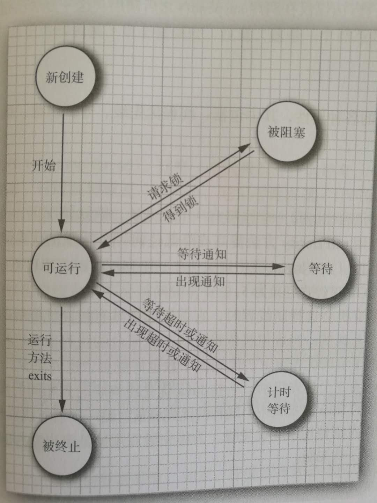

# 线程状态

- New（新创建的）

```java
Thread thread = new Thread();
```

- Runnable（可运行）

  ​一旦调用start()方法，线程就出在runnable状态。一个可运行的线程可能正在运行，也可能没运行，取决于操作系统给线程提供运行的机会。

- Blocked（被阻塞）


- Waiting（等待）
- Timed waiting（计时等待）
- Terminater（被终止的）

  1. 因为run方法正常退出而自然死亡。
  2. 因为一个没有捕获的异常而终止了run方法而意外死亡。

进程间的互相转换

 