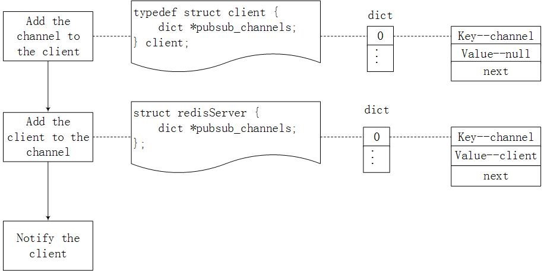
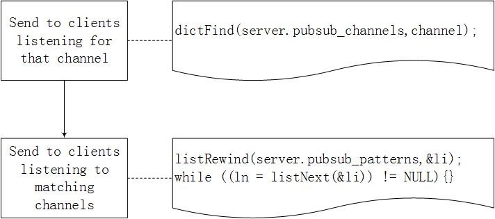

# Redis发布订阅

​	Redis提供了发布订阅功能，可以用于消息的传输，Redis的发布订阅机制包括三个部分，发布者，订阅者和Channel。 

​	发布者和订阅者都是Redis客户端，Channel则为Redis服务器端，发布者将消息发送到某个的频道，订阅了这个频道的订阅者就能接收到这条消息。Redis的这种发布订阅机制与基于主题的发布订阅类似，Channel相当于主题。

```shell
redis 127.0.0.1:6379> SUBSCRIBE redisChat

Reading messages... (press Ctrl-C to quit)
1) "subscribe"
2) "redisChat"
3) (integer) 1
```

```
redis 127.0.0.1:6379> PUBLISH redisChat "Redis is a great caching technique"

(integer) 1

redis 127.0.0.1:6379> PUBLISH redisChat "Learn redis by runoob.com"

(integer) 1

# 订阅者的客户端会显示如下消息
1) "message"
2) "redisChat"
3) "Redis is a great caching technique"
1) "message"
2) "redisChat"
3) "Learn redis by runoob.com"
```

## Redis发布订阅实现

### SUBSCRIBE 	  

​	当客户端订阅某个频道时，Redis需要将该频道和该客户端绑定。首先，在客户端结构体client中，有一个属性为pubsub_channels，该属性表明了该客户端订阅的所有频道，它是一个字典类型，通过哈希表实现，其中的每个元素都包含了一个键值对以及指向下一个元素的指针，每次订阅都要向其中插入一个结点，键表示订阅的频道，值为空。然后，在表示服务器端的结构体redisServer中，也有一个属性为pubsub_channels，但此处它表示的是该服务器端中的所有频道以及订阅了这个频道的客户端，它也是一个字典类型，插入结点时，键表示频道，值则是订阅了这个频道的所有客户端组成的链表。最后Redis通知客户端其订阅成功。


### PSUBSCRIBE 


​	当客户端订阅某个模式时，Redis同样需要将该模式和该客户端绑定。首先，在结构体client中，有一个属性为pubsub_patterns，该属性表示该客户端订阅的所有模式，它是一个链表类型，每个结点包括了订阅的模式和指向下一个结点的指针，每次订阅某个模式时，都要向其中插入一个结点。然后，在结构体redisServer中，有一个属性也叫pubsub_patterns，它表示了该服务器端中的所有模式和订阅了这些模式的客户端，它也是一个链表类型，插入结点时，每个结点都要包含订阅的模式，以及订阅这个模式的客户端，和指向下一个结点的指针。

### PUBLISH 

 

​	当客户端向某个频道发送消息时，Redis首先在结构体redisServer中的pubsub_channels中找出键为该频道的结点，遍历该结点的值，即遍历订阅了该频道的所有客户端，将消息发送给这些客户端。然后，遍历结构体redisServer中的pubsub_patterns，找出包含该频道的模式的结点，将消息发送给订阅了该模式的客户端。


